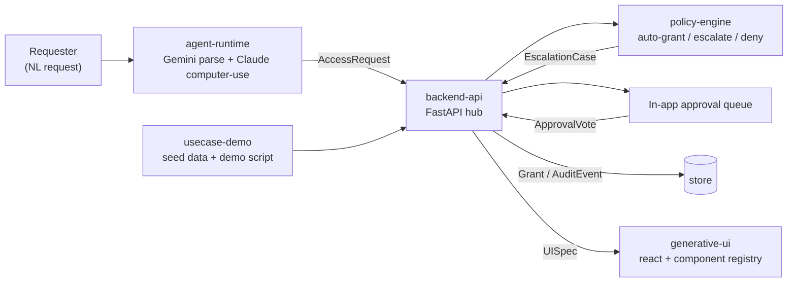

# Aperture — Dynamic Access Scope Agent

**Aperture** — an opening sized to what you're allowed to see — is an agent that gives
**task-bounded access** to corporate tools (mocked GCP: GCS buckets,
BigQuery datasets, Cloud SQL, IAM roles). A requester (e.g. a new hire's coding agent)
describes a task in natural language; the system parses it, runs it through a
**deterministic policy engine**, auto-grants low-risk scoped access, escalates
higher-risk/cross-team access to an in-app approval queue, and auto-revokes everything
when the grant expires or the project closes. A **generative UI layer** renders each
requester's dashboard live, showing only the tools their current grants cover.

Core principle: **Gemini/Claude propose and explain — a deterministic policy engine decides.**
LLMs never directly grant access; they parse requests into structured data and generate
UI/explanations. This keeps the security-critical path auditable, not vibes-based.

**Event:** built at the Conduct x Gemini hackathon — {Tech: Europe} Agentic AI Hack,
London, 19 Sep 2026 — co-hosted by Google DeepMind and Conduct; partners Modal and
Pydantic. Live demos 20:00, opt-in 19:00.

**Design brief:** [`docs/ui-surfaces.html`](docs/ui-surfaces.html) — every UI surface
with 3–4 options and trade-offs, the build order for tonight, track ambitions, and the
judge questions we pre-empt. Each track README has a **core / ambitious / fallback**
ladder; build the core, then climb.

**What's built (19 Sep):** the console (lease timeline, dot-matrix access grid,
per-person approvals, recorder, onboarding) and the agent's MCP server — reasoning,
implementation details, run instructions and cross-track conventions in
[`docs/console-and-mcp.md`](docs/console-and-mcp.md). Visual concepts in
[`docs/ui-directions.html`](docs/ui-directions.html). Open findings from the
adversarial review, with suggested owners, in [`docs/known-bugs.md`](docs/known-bugs.md).

## Architecture



## Workstreams (5 contributors)

| # | Folder | Owns |
|---|--------|------|
| 1 | [`generative-ui/`](generative-ui/README.md) | Gemini-generated `UISpec` → rendered React dashboard, component registry |
| 2 | [`agent-runtime/`](agent-runtime/README.md) | NL request parsing (Gemini), Claude computer-use execution against the mock console, Pydantic audit logging, Modal deployment |
| 3 | [`policy-engine/`](policy-engine/README.md) | Deterministic grant/escalate/deny rules, N-of-M multi-stakeholder escalation, TTL/revocation |
| 4 | [`usecase-demo/`](usecase-demo/README.md) | The dev-onboarding scenario: seed teams/resources/policies, demo script |
| 5 | [`backend-api/`](backend-api/README.md) | FastAPI hub wiring everything together, approval queue endpoints, audit trail, deploy (Railway) |

All five depend on the **shared contract** in [`shared/schemas.py`](shared/README.md) —
read that first. Change it together, not unilaterally; it's the thing that lets five
people build in parallel without blocking each other.

## Demo golden path

1. A new hire's coding agent sends: *"I need `analytics-raw` GCS bucket + `project-x`
   BigQuery dataset to build the ingestion pipeline for Project Atlas, done by Nov 15."*
2. `agent-runtime` parses it into a structured `AccessRequest` via Gemini.
3. `policy-engine` evaluates it: bucket is `internal` tier + single-team → **auto-grant**,
   scoped, TTL'd. Dataset is `restricted` + cross-team → **escalate** to both owning teams.
4. `backend-api` creates a `Grant` for the bucket immediately and an `EscalationCase` for
   the dataset; both logged as `AuditEvent`s.
5. `generative-ui` dashboard updates live: a Bucket panel appears immediately; a "pending
   approval" panel shows for the dataset.
6. Manager opens the approval queue, sees the agent's reasoning, approves. Dataset panel
   appears.
7. `agent-runtime` (computer-use) visibly performs the grant action against the mock
   console — this is the "wow" moment, an agent actually operating the console.
8. TTL expires (or demo triggers "project closed") → both grants auto-revoke, panels
   disappear, audit trail shows the full lifecycle.

## Local setup

Each workstream has its own `requirements.txt` / `package.json` — see its README.
Copy `.env.example` to `.env` and fill in keys (Gemini, Anthropic, Modal, Railway).

```bash
cp .env.example .env
```

## Appendix: original brainstorm notes

Kept verbatim from the first pass on the idea, for context on where the scoping above
came from:

> Password and access management — takes time to provision access. Password management.
> Scopes accessed dynamically. Agent-to-agent.
>
> Onboarder, they plug in their Claude and it automatically gets set up. Intern's role is
> scoped — give them a specific 5% of the system. Your version would be specific to you,
> e.g. finance team. Follow ups.
>
> Something only available recently. Figuring out what's deterministic versus
> probabilistic. Legal involvement.
